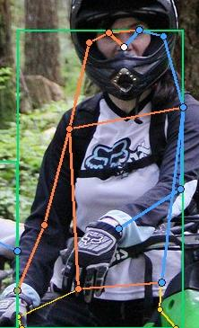
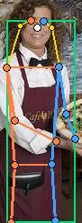
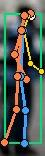
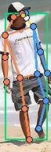
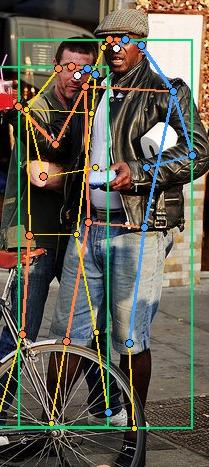
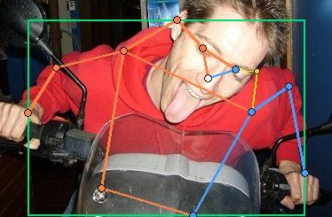

# Mini guideline - nhóm: Cá nhân  |  người gán: Âu Xuân Mạnh (MSSV: 2A202602121)  |  ngày: 16/09/2026

> Điền file này **trong lúc** gán nhãn, không phải sau khi xong. Mỗi lần bạn dừng lại
> hơn 10 giây để phân vân, đó là một dòng phải ghi vào đây.

## 1. Luật bắt buộc (đã thống nhất cả lớp - không sửa)

- Bộ 17 điểm COCO, đúng tên, đúng thứ tự. Lấy từ file `.SVG` chung.
- Mọi người trong ảnh đều có **đủ 17 điểm**. Điểm không dùng được thì gắn cờ, không xoá.
- Trái/phải tính theo **cơ thể người**, không theo bức ảnh.
- Bị che, còn trong khung -> `v = 1`, **vẫn đặt chấm** ở vị trí ước lượng.
- Ra ngoài mép ảnh -> `v = 0`, **không** đặt chấm.
- Không dùng `Hidden` (`h`) - nó không được lưu vào file.

## 2. Luật của nhóm bạn (phải điền)

| Tình huống | Luật nhóm chọn | Vì sao |
| --- | --- | --- |
| Hông của người mặc quần áo dài | Đặt chấm ở vị trí giải phẫu  | Quần áo là trang phục tự nhiên của người, không làm mất vị trí giải phẫu hông |
| Tai bị tóc hoặc mũ bảo hiểm che một phần | Đặt chấm ước lượng góc tai, gán `v = 1`  | Mũ/tóc che bề mặt tai nhưng vẫn nằm trong ảnh và ước lượng được |
| Người bị cắt ở mép ảnh (chỉ thấy từ hông trở lên) | Nằm ngoài mép ảnh gán `v = 0` (Outside), KHÔNG đặt chấm  | Điểm nằm ngoài phạm vi quan sát của bức ảnh |
| Cổ tay nằm sau tay lái / sau thân mình | Đặt chấm ước lượng, gán cờ `v = 1`  | Khớp bị che bởi vật thể/thân mình nhưng vẫn thuộc cơ thể |
| Hai người chồng lên nhau | Ước lượng phần bị che, gán `v = 1`  | Đảm bảo tính nhất quán của mô hình skeleton |
| Người quá nhỏ / quá mờ | Không thể xác định cấu trúc giải phẫu thì bỏ qua  | Tránh đưa dữ liệu nhiễu vào mô hình |

## 3. Ba ca mơ hồ đã gặp (bắt buộc, ghi ít nhất 3)

### Ca 1 - ảnh `train_03.jpg`, người thứ `1` (từ trái sang), khớp `left_wrist` / `left_elbow`

- Mơ hồ ở chỗ nào: Người thứ 2 (từ trái sang) đứng phía trước che khuất hoàn toàn cánh tay trái của người thứ 1. Phân vân giữa việc bỏ qua tay (gán `v = 0`) hay giữ chấm ước lượng (`v = 1`).
- Bạn quyết thế nào: Giữ nguyên đủ 17 điểm, đặt chấm ước lượng tại vị trí tay bị che và gán cờ `v = 1` (Occluded).
- Vì sao: Người thứ 1 vẫn nằm trọn trong khung hình, cánh tay trái bị che bởi người phía trước nên đúng định nghĩa là Occluded (`v = 1`).
- Nếu người khác quyết ngược lại thì model học sai cái gì: Nếu gán `v = 0` hoặc xóa điểm, mô hình sẽ học sai rằng người này bị cụt tay hoặc bỏ sót dự đoán khớp khi có hiện tượng che khuất (occlusion).

### Ca 2 - ảnh `train_13.jpg`, người thứ `1` và `2` (từ trái sang), toàn bộ khớp keypoint

- Mơ hồ ở chỗ nào: Hai người đầu tiên từ trái sang phải bị mờ (blur do chuyển động / out of focus), các khớp không hiện rõ đường nét bề mặt nét căng. Phân vân không biết có nên gán skeleton hay bỏ qua vì mờ.
- Bạn quyết thế nào: Vẫn quyết định gán đủ bộ skeleton 17 điểm cho cả 2 người, với các khớp bị mờ không nhìn rõ đường nét thì gán cờ `v = 1` (Occluded) và đặt chấm ước lượng theo cấu trúc giải phẫu.
- Vì sao: Biên dạng cơ thể người vẫn có thể nhận biết được tổng thể; việc gán nhãn giúp mô hình học khả năng nhận diện đối tượng ngay cả trong điều kiện ảnh bị blur thực tế.
- Nếu người khác quyết ngược lại thì model học sai cái gì: Nếu bỏ qua không gán nhãn, mô hình sẽ học sai rằng đối tượng mờ không phải là người, dẫn đến bỏ sót đối tượng (False Negative) khi gặp video/ảnh chuyển động nhanh hoặc camera rung lắc.

### Ca 3 - ảnh `train_10.jpg`, người thứ `2`, khớp `left_ankle` / `right_ankle`

- Mơ hồ ở chỗ nào: Người đứng ở góc gần mép ảnh, phần cổ chân/bàn chân nằm sát hoặc vượt ra ngoài mép dưới bức ảnh. Phân vân giữa đoán vị trí dưới mép (`v = 1`) hay đánh mốc ngoài khung (`v = 0`).
- Bạn quyết thế nào: Các khớp nằm hoàn toàn vượt qua ranh giới mép ảnh gán cờ `v = 0` (Outside) và không đặt chấm.
- Vì sao: Theo đúng quy tắc COCO, cờ `v = 0` dành riêng cho điểm nằm ngoài ranh giới bức ảnh.
- Nếu người khác quyết ngược lại thì model học sai cái gì: Nếu đặt chấm tràn ra ngoài mép ảnh, tọa độ normalized sẽ bị sai lệch hoặc mô hình học dự đoán điểm vô lý ngoài bức ảnh.

## 4. Sau khi so visibility report với bạn cùng nhóm

- Khớp lệch `%v=1` nhiều nhất: `left_ear` (45%) và `right_ankle` (34%)
- Nguyên nhân là **guideline chưa rõ** hay **một trong hai bên gán sai**: Guideline chưa quy định rõ việc xử lý tóc che tai và phần bàn chân chạm mép ảnh.
- Luật mới bổ sung vào mục 2 sau khi thống nhất: Quy định rõ tai bị tóc che 100% vẫn gán `v = 1` với chấm ước lượng; bàn chân vượt ra khỏi mép ảnh 1 pixel gán `v = 0`.
